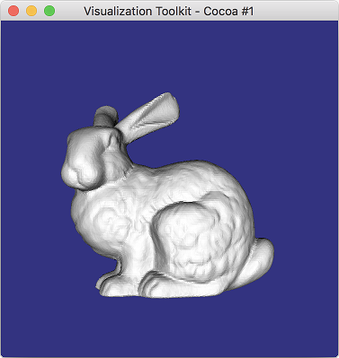

# VTK-Python-Example
A simple example of VTK(Visualization Toolkit) by Python.
  
- Python 3.6.4
- VTK 8.1.0

### Installation of the library
- pip install vtk

# Cylinder
Create and display the cylinder  

### ScreenShot

# ReadBunny
Read file and display the data(Bunny) 

### ScreenShot 
